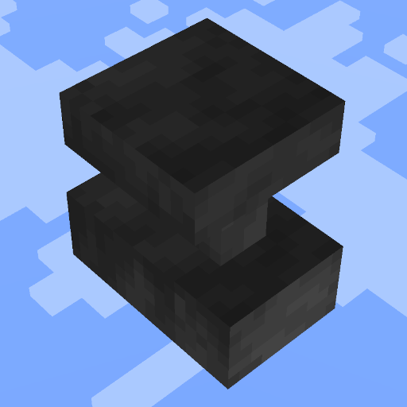

# BugFixerUpper

BugFixerUpper is a Minecraft mod that fixes a few critical and non-critical bugs in the game.

## Features
- Whatever you suggest in the issue tracker.

### Chunk loading and generation
- Prevent passenger entities from sending game events during chunk loading/generation causing deadlocks.
- Prevent item frames from sending sounds and events during chunk loading/generation.

### Misc
- Save vehicle passengers at their actual position (MC-263030).
- Parrot mob spawner blocks treat all air types equally (MC-232359).

## Features (Creative Mode)
### Structure blocks
- Structure blocks load paintings at the correct position (Thanks to BluSpring) (MC-102223).
- Structure blocks with combined mirror and rotation place paintings and item frames with the correct rotation.

### Tick freeze
- Prevent players from unfreezing other passengers in multi-seat vehicles during tick freeze (MC-268358).

## Installation

Must be installed on the server to work in multiplayer. For usage in singleplayer worlds, the mod has to be installed on the client.
1. Download the mod from [Modrinth](https://modrinth.com/mod/bug-fixer-upper) or [CurseForge](https://www.curseforge.com/minecraft/mc-mods/bug-fixer-upper).
2. Place the downloaded `.jar` file into the `mods` folder of your Minecraft directory.
3. Launch Minecraft with the Fabric mod loader.

## Usage

- Install the mod and be happy that some bugs are fixed.